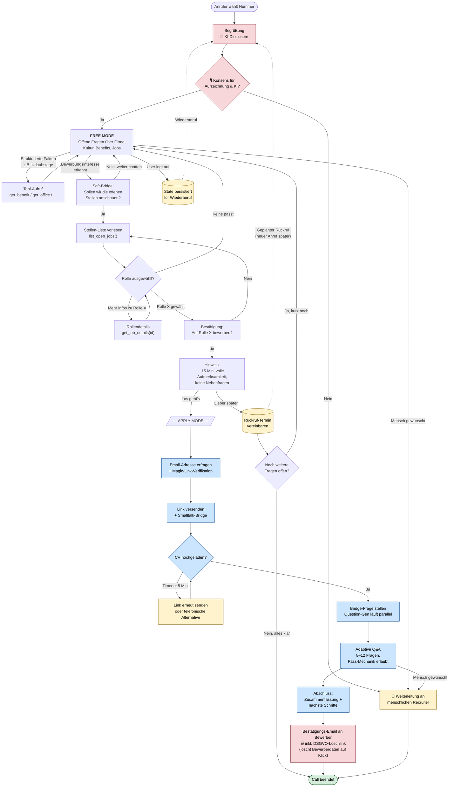

# 01 — User Journey

Linearer End-to-End-Flow aus Sicht des Anrufers. Zeigt alle Hauptpfade und Off-Ramps.

## Kritische Übergänge

| # | Übergang | Warum heikel |
|---|---|---|
| 1 | Free → Bridge | Intent-Detection; zu früh = aufdringlich, zu spät = verpasste Conversion |
| 2 | Confirm → Commit | letzte Chance zum Rückzug; Commitment-Vertrag mit User |
| 3 | SendLink → Upload | Wartezeit von 30s–5min ohne Mensch dahinter; Bridge-Smalltalk Pflicht |
| 4 | Upload → BridgeQ | Question-Gen dauert 5–15s; ohne Bridge-Frage = peinliche Stille |
| 5 | Interview → Wrap | Adaptive Beendigung — wann genug? |

## Off-Ramp-Strategie

Jeder blaue Apply-Mode-Knoten muss eine **explizite "Mensch sprechen"-Option** unterstützen. Im Prompt verankert: *„Wenn der Nutzer das Wort 'Mensch', 'echter Recruiter', 'jemand anderes' sagt, sofort eskalieren ohne Rückfrage."*

## Was nicht im Diagramm steht

- **Identifikation per Telefonnummer** vor Greeting: Wiederanrufer? Existierender Bewerbungsstatus? Spart Doppelarbeit.
- **Sprachwahl** (DE/EN/...): am Anfang erkennen oder explizit fragen.
- **Audio-Qualität-Check**: bei sehr schlechter Verbindung früh anbieten zurückzurufen.
