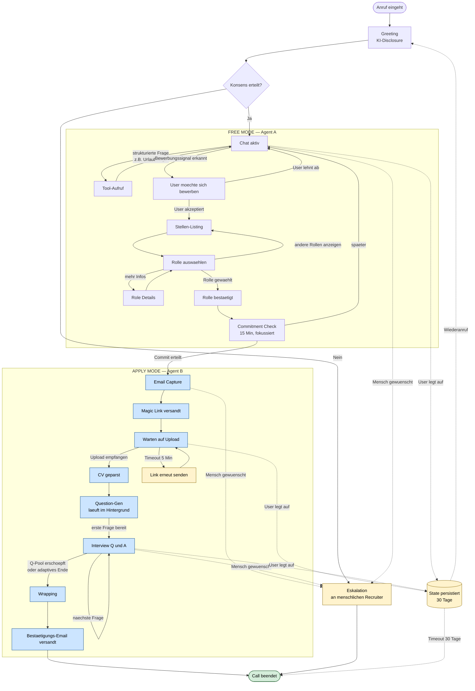

# 02 — Agent State Machine

Interne Sicht: zwei Top-Level-Modi (`FREE MODE` = Agent A, `APPLY MODE` = Agent B) mit jeweils eigenen Sub-States. Übergänge sind getriggert durch User-Intent oder System-Events.

> **Hinweis zur Renderer-Kompatibilität:** Notion rendert `stateDiagram-v2` (insbesondere mit nested states) unzuverlässig. Diese Datei nutzt deshalb `flowchart`-Syntax mit `subgraph`-Blöcken — semantisch identisch, in Notion / GitHub / mermaid.live zuverlässig darstellbar.

## Wichtige State-Invarianten

| Invariante | Bedeutung |
|---|---|
| **Konsens vor allen Sub-States** | Kein Übergang aus `Greeting` ohne explizit dokumentierten Konsens |
| **Eskalation aus jedem State erreichbar** | Trigger-Wörter ("Mensch", "echter Recruiter") = sofortiger Übergang |
| **State-Persistierung** | Bei Abbruch wird letzter Sub-State + Kontext gespeichert (Schlüssel: Telefon + Email) |
| **DSGVO-Löschfrist** | Persisted State automatisch nach 30 Tagen gelöscht (oder konfigurabel pro Mandant) |
| **Modus-Wechsel nur in eine Richtung** | `FREE MODE → APPLY MODE` per Commitment. Rückkehr nur über erneuten Trigger oder Eskalation |

## Prompt-Design pro Modus

### FREE MODE System-Prompt (Skizze)
- Persona: warm, kompetent, neugierig — wie ein erfahrener Mitarbeiter, der gern erzählt
- Wissensbasis: in-context Briefing + Tool-Liste mit klaren Anwendungsregeln
- **Anti-Halluzinations-Regel**: konkrete Zahlen / Stellen / Benefits *immer* via Tool, nie schätzen
- Bridge-Trigger: erkenne Bewerbungssignale, frage explizit nach
- Off-Ramp: bei Trigger-Wörtern sofort eskalieren

### APPLY MODE System-Prompt (Skizze)
- Persona: fokussiert, strukturiert, freundlich aber zielgerichtet
- Strikte State-Maschine: kein "Plaudern", außer kurze Bridge zur Latenz-Überbrückung
- Question-Bank: dynamisch generiert pro CV + Rolle, mit Schwierigkeitsgrad
- Adaptive Beendigung: nach 8–12 Fragen oder bei klarer Score-Konvergenz
- **Pass-Mechanik**: User darf eine Frage überspringen ohne Begründung

## Was gehört bewusst NICHT in einen Sub-Agent

- Stellen-Listing → **Tool**, nicht Agent
- CV-Parsing → **Async-Service**, nicht Agent
- Scoring → **Post-Call Pipeline**, nicht im Live-Agent

Sub-Agenten lohnen sich nur, wenn sie eigene Persona + eigenes Tool-Set + eigenen Prompt brauchen. Hier ist ein Tool / Service ausreichend und latenz-freundlicher.
