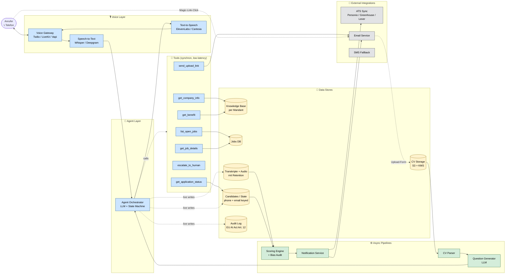

# 03 — Backend Architecture

Services, Tools und Datenflüsse hinter dem Live-Agenten.

## Latenz-Budget pro Layer (Voice ist unforgiving)

| Komponente | Ziel | Killer ab |
|---|---|---|
| STT (partial) | <200 ms | >500 ms |
| Agent-LLM-Inferenz | <800 ms | >1.5 s |
| Tool-Call (DB) | <50 ms | >200 ms |
| TTS Time-to-First-Byte | <300 ms | >700 ms |
| **Gesamt: Mund auf → Mund auf** | **<1.5 s** | **>2.5 s = abgehackt** |

→ RAG mit Reranking kostet typisch 200–500 ms. **Deshalb hybrider Ansatz**: kompaktes Briefing in-context + Tools für deterministische Lookups, RAG nur bei sehr großen KBs.

## Asynchrone Pipelines im Detail

### CV Parser
- Input: PDF/DOCX/Image aus S3
- Service: eigen oder Affinda / Sovren / RChilli
- Output: strukturiertes JSON (Erfahrung, Skills, Education, Sprachen)
- SLA: <15s p95, sonst Bridge-Frage länger ziehen

### Question Generator
- Input: CV-JSON + Job-Description + Mandant-Tonalität
- Output: 12–15 Fragen, kategorisiert (technisch / Verhalten / Motivation), mit Bewertungsrubrik
- LLM: Claude Sonnet 4.6 oder Haiku 4.5 (Latenz + Kosten)
- **Streaming**: erste Frage nach ~3s verfügbar, Rest läuft parallel zum Interview

### Scoring + Bias Audit
- Input: vollständiges Transkript + Antwortbewertungen
- Output: Multi-Dimensional Score (Fit, Skills, Kommunikation, Motivation) + Begründung + Bias-Flag
- **EU AI Act Art. 10 (Datenqualität) + Art. 15 (Genauigkeit)**: regelmäßiger Bias-Audit-Job über Aggregat
- Recruiter sieht Score *mit* Begründung, nicht als Black Box

### Notification Service
- Recruiter-Email: HTML mit Score, Top-3-Highlights, Risk-Flags, Audio-Link, Transkript-Link
- Bewerber-Email: warm, danke, nächste Schritte, **Lösch-Link** (DSGVO Art. 17)
- ATS-Sync: Push in Personio/Greenhouse via API mit Standard-Mapping

## Multi-Tenancy

Pro Mandant (Kundenfirma) eigener Slot:
- **Knowledge Base** (Briefing-Doc + strukturierte Facts)
- **Jobs DB** (offene Stellen)
- **Tonalität / Persona** (Sie/Du, formell/locker, Branding)
- **Scoring-Rubrik** (rollenspezifische Gewichtung)
- **ATS-Endpoint**

Shared:
- Voice Gateway, STT, TTS (auf Anbieter-Basis)
- LLM-Modelle
- Async-Pipelines

## Compliance-Bausteine im Stack

| Anforderung | Wo umgesetzt |
|---|---|
| **EU AI Act Art. 12** (Logging) | Audit Log Store, immutable |
| **EU AI Act Art. 14** (Human Oversight) | escalate_to_human Tool + Recruiter-Review-UI |
| **EU AI Act Art. 13** (Transparency) | KI-Disclosure im Greeting + Email |
| **DSGVO Art. 17** (Löschung) | Lösch-Link in jeder Email + automatische Retention-Pipeline |
| **DSGVO Art. 30** (VVT) | aus Datenmodell auto-generierbar |
| **DSGVO Art. 32** (Security) | KMS-Encryption für CV/Transkript-Storage, TLS überall |
| **ISO 27001** | Backup, IAM, Change Management — getrennt dokumentiert |
| **ISO 42001** (AI MS) | Bias-Audit-Pipeline, Risk Register, Model Cards |

## Offene Fragen / nächste Entscheidungen

1. **Voice-Provider**: LiveKit (Open Source, self-hosted möglich, EU-freundlich) vs. Vapi (mehr Features, US-hosted) vs. Retell vs. Twilio
2. **STT für Deutsch**: Deepgram Nova-3 (gut, US) vs. Whisper (lokal hostbar) vs. Speechmatics (EU)
3. **TTS für Deutsch**: ElevenLabs Multilingual v2 vs. Cartesia Sonic vs. Azure Neural
4. **CV-Parser**: Build vs. Buy (Affinda ist gut, kostet ~€0.10 / CV)
5. **Hosting / Datenresidenz**: AWS Frankfurt, Hetzner, oder OVHcloud — DSGVO + AI Act-Vorteile durch EU-only
